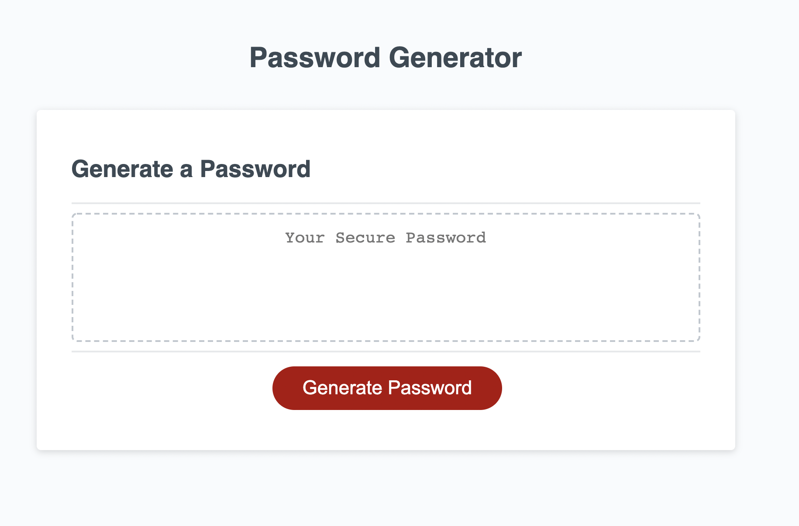
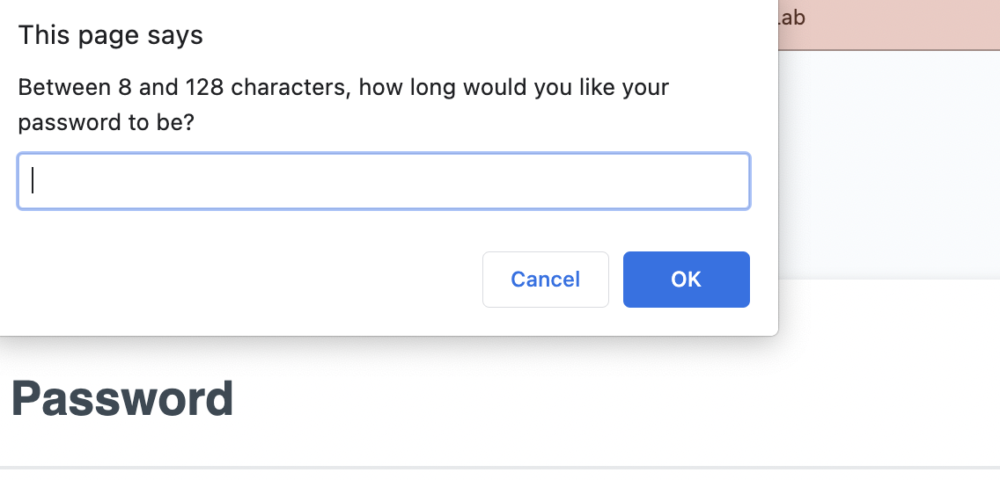

# Password Generator

## Description

The web application will generate a password based on user criteria. The user is able to pick the length of password between 8 and 128 characters. If the user selects an amount outside of the specified range they will be alerted to restart. The user will then have the ability to pick if they would like their password to include upper-case letters, lower-case letters, number or special characters. The application will check to enusure that the user selected at least one type of character. The application will then produce an random password based on the users selections. The application is a adptive to display on different screen sizes.

### Installation

The application runs on HTML, CSS and Javascript. Only requires a broswer and internet to run.

#### Usage

The homescreen that the user is presented with.

The user is then promoted with an alert that directs them to choose password length and contents but hitting "okay" or "cancel"

The randomly generated password after user completes promtps.

### License

Copyright 2021

Permission is hereby granted, free of charge, to any person obtaining a copy of this software and associated documentation files (the "Software"), to deal in the Software without restriction, including without limitation the rights to use, copy, modify, merge, publish, distribute, sublicense, and/or sell copies of the Software, and to permit persons to whom the Software is furnished to do so, subject to the following conditions:

The above copyright notice and this permission notice shall be included in all copies or substantial portions of the Software.

THE SOFTWARE IS PROVIDED "AS IS", WITHOUT WARRANTY OF ANY KIND, EXPRESS OR IMPLIED, INCLUDING BUT NOT LIMITED TO THE WARRANTIES OF MERCHANTABILITY, FITNESS FOR A PARTICULAR PURPOSE AND NONINFRINGEMENT. IN NO EVENT SHALL THE AUTHORS OR COPYRIGHT HOLDERS BE LIABLE FOR ANY CLAIM, DAMAGES OR OTHER LIABILITY, WHETHER IN AN ACTION OF CONTRACT, TORT OR OTHERWISE, ARISING FROM, OUT OF OR IN CONNECTION WITH THE SOFTWARE OR THE USE OR OTHER DEALINGS IN THE SOFTWARE.
